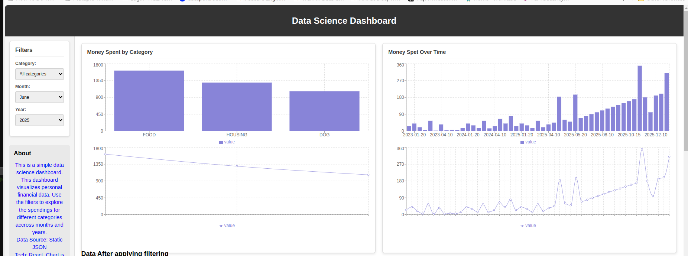
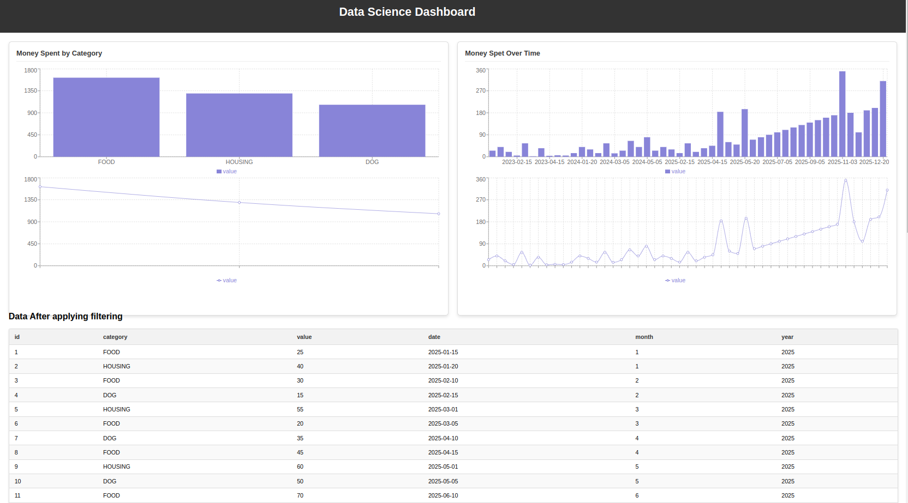
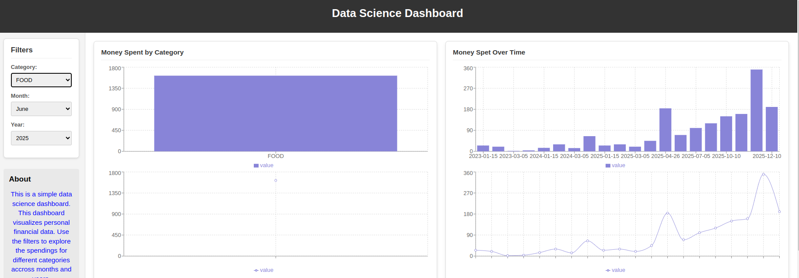
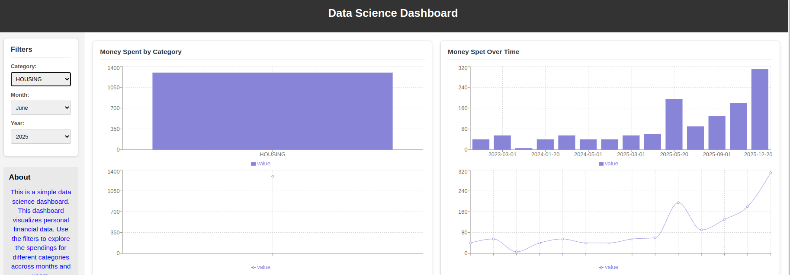
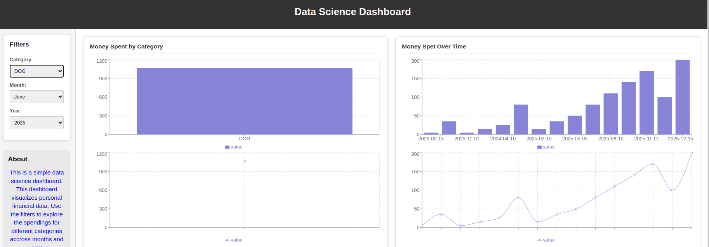
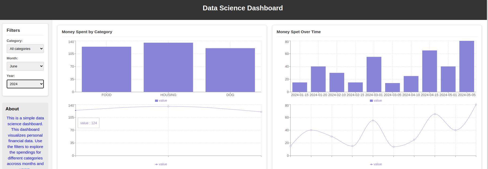
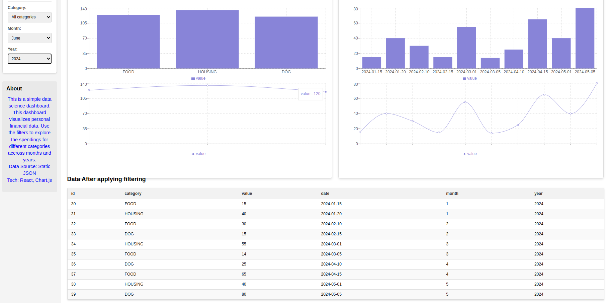
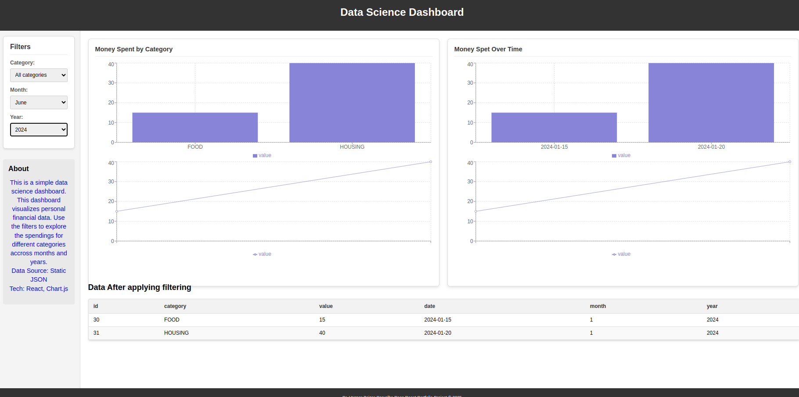

# Project Idea: Interactive Data Exploration & Visualization Dashboard

- This project aims to create a web application where you can showcase insights from a chosen dataset through interactive visualizations. It demonstrates your ability to process data, extract meaning, and present it effectively using web technologies.
- Core Concept:
Build a single-page application (SPA) using React that loads a dataset (or data from an API) and allows users (like potential employers) to explore it through various charts, filters, and summaries.
- Key Features & Data Science Aspects to Showcase:
    1. Dataset Selection:
        - Choose 1-3 interesting datasets you've worked with or find compelling public datasets (e.g., from Kaggle, data.gov, WHO, World Bank, a specific API like GitHub or a weather API). 
        - Data Science Skill: Data sourcing, understanding data context, potential data cleaning/preprocessing (which you should document). 
    2. Dashboard Overview:
        - A main page summarizing key findings or metrics from the dataset. 
        - Display key performance indicators (KPIs) or summary statistics (mean, median, counts, etc.). 
        - Data Science Skill: Identifying key metrics, summarizing data, communicating high-level insights. 
    3. Interactive Visualizations:
        - Include several types of charts (e.g., line charts for time series, bar charts for comparisons, scatter plots for correlations, potentially maps if geographical data is involved). 
        - Use a React charting library (like Recharts, Chart.js (with react-chartjs-2), Nivo, or even Plotly.js). 
        - Implement features like tooltips on hover to show specific data points. 
        Data Science Skill: Data visualization, choosing appropriate chart types, interpreting patterns and correlations. 
    4. Data Filtering & Interaction:
        - Allow users to filter the data dynamically (e.g., by date range, category, region). 
        - As filters are applied, the charts and summaries should update automatically. 
        - Potentially allow users to select different variables for the axes of a scatter plot. 
        - Data Science Skill: Data manipulation, understanding subsets and segmentation. 
    5. Data Table View (Optional but recommended):
        - Include a section where users can view the raw or processed data in a table format. 
        - Implement features like sorting and pagination for the table. 
        - Data Science Skill: Data presentation, attention to detail. 
    6. Project Explanation:
        - Have an "About" or "Info" section explaining: 
            - The dataset(s) used and their source. 
            - Any data cleaning or preprocessing steps performed. 
            - The key insights or questions the dashboard aims to answer. 
            - The technologies used (React, charting library, etc.). 
        - Data Science Skill: Communication, documentation, explaining methodology. 
- Technology Stack:
    - Frontend: 
        - React: The core library for building the UI. 
        - Charting Library: Recharts, react-chartjs-2, Nivo, or Plotly.js. 
        - State Management (Optional): For simpler projects, React Context API or Zustand might suffice. For more complex state, consider Redux Toolkit. 
        - Styling: CSS Modules, Styled Components, Tailwind CSS, or a UI library like Material UI / Chakra UI. 
        - Data Fetching: Workspace API or libraries like axios. 
    - Data: 
        - Could be static JSON files included in the React project. 
        - Could be fetched from an external API. 
        - (Advanced) Could be served from a simple backend API (e.g., using Python Flask/FastAPI or Node.js/Express) that you build to preprocess or serve data dynamically. 
Steps to Build:
    1. Select & Prepare Data: Choose your dataset(s). Clean and process them if necessary (using Python/Pandas or R beforehand is common). Save the data in a suitable format (like JSON or CSV). 
    2. Set Up React Project: Use Create React App (npx create-react-app my-dashboard) or Vite (npm create vite@latest my-dashboard -- --template react) to initialize your project. 
    3. Plan Components: Break the UI into components (e.g., Dashboard, ChartCard, FilterPanel, DataTable, Sidebar, Header). 
    4. Load Data: Implement logic to load your static data files or fetch from an API when the application starts or components mount (useEffect hook). 
    5. Implement Visualizations: Integrate your chosen charting library to display the data. Start with one chart type and expand. 
    6. Add Interactivity: Use React state (useState, useReducer, or a state management library) to handle user inputs from filters and update the data passed to the charts. 
    7. Style the App: Apply CSS or use a UI framework to make it look professional and visually appealing. 
    8. Write Explanations: Create the "About" section with clear descriptions. 
    9. Test: Ensure everything works correctly, including responsiveness on different screen sizes. 
    10. Deploy: Deploy your application to a platform like Netlify, Vercel, or GitHub Pages so others can view it live. 
    11. Showcase: Add the link to the live project and its source code (on GitHub) to your main portfolio website or resume. 
This project provides a strong balance, demonstrating your ability to handle data, extract insights, and build functional, user-friendly web applications – all valuable skills for a data scientist working in a modern team.

## Demonstrating the Usage of the Financial Dashboard React App

# Getting Started with Create React App

This project was bootstrapped with [Create React App](https://github.com/facebook/create-react-app).

## Available Scripts

In the project directory, you can run:

### `npm start`

Runs the app in the development mode.\
Open [http://localhost:3000](http://localhost:3000) to view it in your browser.

The page will reload when you make changes.\
You may also see any lint errors in the console.

### `npm test`

Launches the test runner in the interactive watch mode.\
See the section about [running tests](https://facebook.github.io/create-react-app/docs/running-tests) for more information.

### `npm run build`

Builds the app for production to the `build` folder.\
It correctly bundles React in production mode and optimizes the build for the best performance.

The build is minified and the filenames include the hashes.\
Your app is ready to be deployed!

See the section about [deployment](https://facebook.github.io/create-react-app/docs/deployment) for more information.

### `npm run eject`

**Note: this is a one-way operation. Once you `eject`, you can't go back!**

If you aren't satisfied with the build tool and configuration choices, you can `eject` at any time. This command will remove the single build dependency from your project.

Instead, it will copy all the configuration files and the transitive dependencies (webpack, Babel, ESLint, etc) right into your project so you have full control over them. All of the commands except `eject` will still work, but they will point to the copied scripts so you can tweak them. At this point you're on your own.

You don't have to ever use `eject`. The curated feature set is suitable for small and middle deployments, and you shouldn't feel obligated to use this feature. However we understand that this tool wouldn't be useful if you couldn't customize it when you are ready for it.

## Learn More

You can learn more in the [Create React App documentation](https://facebook.github.io/create-react-app/docs/getting-started).

To learn React, check out the [React documentation](https://reactjs.org/).

### Code Splitting

This section has moved here: [https://facebook.github.io/create-react-app/docs/code-splitting](https://facebook.github.io/create-react-app/docs/code-splitting)

### Analyzing the Bundle Size

This section has moved here: [https://facebook.github.io/create-react-app/docs/analyzing-the-bundle-size](https://facebook.github.io/create-react-app/docs/analyzing-the-bundle-size)

### Making a Progressive Web App

This section has moved here: [https://facebook.github.io/create-react-app/docs/making-a-progressive-web-app](https://facebook.github.io/create-react-app/docs/making-a-progressive-web-app)

### Advanced Configuration

This section has moved here: [https://facebook.github.io/create-react-app/docs/advanced-configuration](https://facebook.github.io/create-react-app/docs/advanced-configuration)

### Deployment

This section has moved here: [https://facebook.github.io/create-react-app/docs/deployment](https://facebook.github.io/create-react-app/docs/deployment)

### `npm run build` fails to minify

This section has moved here: [https://facebook.github.io/create-react-app/docs/troubleshooting#npm-run-build-fails-to-minify](https://facebook.github.io/create-react-app/docs/troubleshooting#npm-run-build-fails-to-minify)
